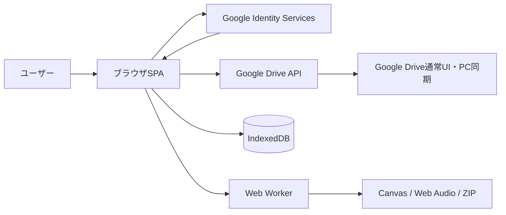

> 旧Google Drive版の記録です。2026-09-22以降の仕様は [Kubernetes版](kubernetes-architecture.md) を参照してください。

# 2D Webゲーム素材管理アプリ 設計書

- 文書バージョン: 0.2
- 作成日: 2026-09-21
- 対象構成: Google Drive API版
- 想定規模: 最大約10,000素材
- 想定利用者: 単一ユーザー
- 共同編集: 対象外

## 1. 概要

本アプリケーションは、2D Webゲーム開発で使用する画像、マップ、キャラクター差分、音楽、効果音設定をGoogle Drive上で一元管理するブラウザアプリケーションである。

Google Driveを永続データの正本とし、ブラウザのIndexedDBを一覧・サムネイル・検索索引のキャッシュとして利用する。専用RDBおよび常駐バックエンドは初期構成では設置しない。

Google Drive上の各ファイルには、一覧表示と検索に必要な短い情報を`appProperties`として付与する。マップ、キャラクター合成設定、jsfxr設定などの構造化データはJSONファイルとしてDriveへ保存する。

## 2. 目的

### 2.1 機能目的

1. 画像素材をタグ付きで保存、閲覧、検索する。
2. スプライトシートやマップタイル画像をブラウザ上で分割し、派生素材として保存する。
3. 技術的に実現可能な場合、選択した複数素材をストリーミング処理でZIPにまとめてダウンロードする。
4. タイル素材から複数レイヤーの2Dマップを作成、編集する。
5. 複数画像を重ねてキャラクターの表情・衣装差分を作成する。
6. 音声素材とjsfxr互換JSONを保存、検索、再生する。
7. ブラウザ上で小さな効果音を合成する。
8. Google Driveの通常UIおよびPC同期機能からも素材本体へアクセスできるようにする。

### 2.2 技術目的

- 専用データベースを運用しない。
- ストレージ費用を既存のGoogle Drive契約へ集約する。
- 素材数10,000件程度で実用的な起動時間と検索性能を得る。
- ストレージアクセス層を分離し、将来R2やGoogle Cloud Storageへ移行可能にする。
- Drive上のファイルIDを参照キーとして利用し、名前変更やフォルダ移動に耐える。

## 3. 対象外

初期版では以下を対象外とする。

- 複数ユーザーによる同時編集
- 細粒度のロール・権限管理
- ゲーム実行時のCDNとしての素材配信
- サーバー側での大規模画像・動画・音声変換
- 数十万件以上の素材管理
- AIによる自動タグ付けや画像類似検索
- オフライン状態での編集内容の自動同期
- Google Drive以外のストレージとの双方向同期
- 素材およびプロジェクトの履歴管理
- Google Drive UIやPC同期経由で追加された未管理ファイルの自動登録

## 4. 前提と制約

### 4.1 Google Drive APIの制約

- `files.list`の最大ページサイズは1,000件である。
- `files.list`は返却フィールドを`fields`で明示しない場合、必要なメタデータを返さない。
- `appProperties`は1アプリ・1ファイルにつき最大30個である。
- 各カスタムプロパティのキーと値の合計はUTF-8で最大124バイトである。
- `thumbnailLink`は短時間で失効し、Webアプリからの直接利用にはCORS上の制約がある。
- DriveはCDNではないため、画面外の画像を含む一括ダウンロードは行わない。
- ファイル一覧取得中にDrive側で変更が行われた場合、複数ページ全体のスナップショット分離は保証されない。単一ユーザー前提では許容し、差分同期で補正する。
- 対応対象は特定ブラウザエンジンに限定せず、Google Drive API、IndexedDB、Web Worker、Canvas、Web Audioなど必要な標準機能を備えたモダンブラウザ全般とする。
- 1回のユーザー操作によってGoogle Driveへ書き込むファイルの合計が1 GB（1,000,000,000バイト）を超える場合は、不正な操作としてアップロード開始前に中断する。
- Google Drive側の容量、API、アップロード上限も最終的な制限として扱い、Drive APIから返されたエラーをユーザーへ表示する。

### 4.2 データ整合性の方針

- Google Drive上のデータを正本とする。
- IndexedDBは破棄・再構築可能なキャッシュとする。
- 各素材の更新はファイル単位で完結させる。
- 複数ファイルを変更する操作は冪等な手順として実装し、中断後に再開できるようにする。
- 親子参照やコレクション参照の存在確認を起動時または診断実行時に行う。

## 5. システム構成



### 5.1 コンポーネント

| コンポーネント | 責務 |
|---|---|
| SPA | 画面表示、編集、検索、Drive API連携 |
| Google Identity Services | OAuth認証とアクセストークン取得 |
| Google Drive API | 素材・プロジェクト・メタデータの永続化 |
| IndexedDB | 一覧、詳細、サムネイル、差分同期トークンのキャッシュ |
| Web Worker | ハッシュ、画像変換、ZIP生成などのCPU負荷処理 |
| Canvas / OffscreenCanvas | タイル分割、合成、縮小画像生成 |
| Web Audio | 音声再生、波形処理、jsfxr互換音声生成 |

### 5.2 配置

初期版は静的SPAとしてホスティングする。Cloudflare Pages、Firebase Hosting、GitHub Pagesなどを利用できる。

常駐APIサーバーは不要とする。Google OAuthアクセストークンはブラウザメモリ上だけに保持し、LocalStorageやIndexedDBへ永続保存しない。

## 6. Google Drive上の構成

アプリ初回起動時に専用ルートフォルダを作成する。

```text
2D Game Asset Manager/
├─ Assets/
│  ├─ Images/
│  └─ Audio/
├─ Derived/
│  ├─ Images/
│  ├─ Audio/
│  └─ Thumbnails/
├─ Projects/
│  ├─ Maps/
│  ├─ Characters/
│  └─ Sounds/
├─ Collections/
├─ Exports/
└─ System/
   ├─ tag-definitions.json
   ├─ settings.json
   └─ diagnostics.json
```

フォルダはユーザーの可読性とDrive UIからの操作性のために使用する。アプリ内での識別にはパスやファイル名ではなくDriveの`fileId`を使用する。

## 7. 認証・認可

### 7.1 初期版

Google Identity ServicesのOAuth 2.0トークンモデルを使用する。

本アプリは完全な個人用の非公開アプリとし、以下のスコープを使用する。

```text
https://www.googleapis.com/auth/drive
```

アクセストークンの有効期限切れ時は再認証を要求する。リフレッシュトークンをブラウザへ保存しない。

### 7.2 将来一般公開する場合

一般公開は初期版の対象外とする。将来一般公開する場合はOAuth審査とアクセス範囲を再評価し、可能であれば以下へ縮小する。

```text
https://www.googleapis.com/auth/drive.file
```

ただし`drive.file`では、ユーザーがDrive UIから任意に追加したファイルを自動的に参照できない場合がある。その場合はGoogle Pickerによる明示選択、またはアプリ経由でのアップロードに利用方法を限定する。

## 8. Driveファイルの識別

すべての管理対象ファイルに`appProperties`を付与する。

### 8.1 共通プロパティ

| キー | 内容 | 例 |
|---|---|---|
| `am` | 本アプリ管理対象 | `1` |
| `amV` | メタデータスキーマ | `1` |
| `amId` | アプリ内素材ID | UUID/ULID |
| `amKind` | レコード種別 | `asset`, `map`, `character`, `sound`, `collection` |
| `amType` | 素材種別 | `image`, `audio`, `json` |
| `amRole` | ファイル役割 | `source`, `derived`, `thumbnail`, `project` |
| `amParent` | 派生元の`amId` | ULID |
| `amTags` | 短いタグID列 | `t01,t07,t18` |
| `amHash` | SHA-256 | 64桁hex |

`amHash`はキー名を含めても124バイト以内に収まる。タグ名そのものは長くなる可能性があるため、`amTags`には短いタグIDを保存する。

### 8.2 タグ定義

`System/tag-definitions.json`にタグIDと表示名を保存する。

```json
{
  "schemaVersion": 1,
  "revision": 12,
  "tags": [
    { "id": "t01", "name": "マップチップ", "color": "green" },
    { "id": "t02", "name": "キャラクター", "color": "blue" },
    { "id": "t03", "name": "効果音", "color": "orange" }
  ]
}
```

1素材あたりのタグ数は初期版では最大20個とする。上限を超える場合は、詳細JSONへ退避するかメタデータ方式を再設計する。

### 8.3 詳細メタデータ

一覧表示に不要な詳細情報は、以下のどちらかへ保存する。

1. Drive標準の`description`
2. プロジェクトJSONまたは素材詳細JSON

詳細情報の例:

- 出典URL
- ライセンス注記
- 画像のタイル幅、余白、間隔
- jsfxrの全パラメータ
- キャラクター合成レイヤー
- マップセルデータ

## 9. アプリ内データモデル

### 9.1 AssetSummary

```ts
interface AssetSummary {
  driveFileId: string;
  assetId: string;
  name: string;
  kind: "asset";
  type: "image" | "audio" | "json";
  role: "source" | "derived" | "thumbnail";
  mimeType: string;
  size: number;
  modifiedTime: string;
  driveVersion: string;
  md5Checksum?: string;
  sha256?: string;
  tagIds: string[];
  parentAssetId?: string;
}
```

### 9.2 ImageMetadata

```ts
interface ImageMetadata {
  width: number;
  height: number;
  hasAlpha?: boolean;
  tile?: {
    width: number;
    height: number;
    margin: number;
    spacing: number;
  };
}
```

アプリが画像を生成してGoogle Driveへ保存する場合、出力形式はPNGだけとする。インポート素材については、実行中のブラウザが標準機能で安全かつ無理なくデコード・表示できる画像形式を機能検出に基づいて受け入れる。

SVGは素材管理、タグ付け、検索、一覧・詳細表示の対象に含める。ただしラスターデータを前提とするタイル分割、マップ編集、キャラクター差分合成、ピクセル処理の入力には使用しない。

### 9.3 AudioMetadata

```ts
interface AudioMetadata {
  durationMs: number;
  sampleRate?: number;
  channels?: number;
  codec?: string;
}
```

### 9.4 MapProject

```ts
interface MapProject {
  schemaVersion: 1;
  id: string;
  name: string;
  width: number;
  height: number;
  tileWidth: number;
  tileHeight: number;
  layers: MapLayer[];
  tilesets: AssetReference[];
  updatedAt: string;
}

interface MapLayer {
  id: string;
  name: string;
  visible: boolean;
  opacity: number;
  locked: boolean;
  cells: number[];
}
```

マップJSONが数MBを超える場合は、レイヤー単位またはチャンク単位へ分割する。初期版は単一JSONとする。

### 9.5 CharacterComposition

```ts
interface CharacterComposition {
  schemaVersion: 1;
  id: string;
  name: string;
  canvas: { width: number; height: number };
  layers: CharacterLayer[];
  updatedAt: string;
}

interface CharacterLayer {
  id: string;
  assetId: string;
  x: number;
  y: number;
  scaleX: number;
  scaleY: number;
  rotation: number;
  opacity: number;
  visible: boolean;
  zIndex: number;
}
```

### 9.6 SoundPreset

```ts
interface SoundPreset {
  schemaVersion: 1;
  id: string;
  name: string;
  format: "jsfxr";
  parameters: Record<string, number | string | boolean>;
  renderedAssetId?: string;
  updatedAt: string;
}
```

アプリが生成・保存する音声関連データはjsfxr互換JSONだけとする。効果音はブラウザ上で合成・試聴するが、初期版ではWAV、MP3、OGGなどの音声ファイルを生成しない。インポート音声は、実行中のブラウザが標準の`HTMLAudioElement`またはWeb Audio APIで無理なく扱える形式を機能検出に基づいて受け入れる。

## 10. Google Drive API利用方法

### 10.1 初回一覧取得

アプリ管理対象だけを取得する。

```text
q = appProperties has { key='am' and value='1' } and trashed=false
```

要求フィールド:

```text
nextPageToken,
files(
  id,
  name,
  mimeType,
  size,
  modifiedTime,
  version,
  md5Checksum,
  parents,
  appProperties,
  thumbnailLink
)
```

`pageSize=1000`でページングし、全ページを取得後にIndexedDBへ一括反映する。

### 10.2 差分同期

初期同期完了後に`changes.getStartPageToken`でトークンを取得してIndexedDBへ保存する。

次回起動時は`changes.list`で以下を取得する。

- 新規ファイル
- 更新ファイル
- 削除またはゴミ箱移動
- フォルダ移動

全ページ処理後、返却された新しいページトークンを保存する。トークンが無効な場合は全件同期へフォールバックする。

### 10.3 ファイルアップロード

処理手順:

1. ブラウザでファイル種別とサイズを検証する。
2. 1回の操作でDriveへ書き込む全ファイルの合計予定サイズを算出する。
3. 合計が1 GB（1,000,000,000バイト）を超える場合は、不正な操作として中断する。
4. Web WorkerでSHA-256を計算する。
5. IndexedDB上の`amHash`索引で重複候補を検索する。
6. ユーザーへ重複候補を提示する。
7. 小規模ファイルはmultipart upload、大規模ファイルはresumable uploadを使用する。
8. 作成時に`appProperties`を同時設定する。
9. Driveの返却結果をIndexedDBへ登録する。
10. 必要に応じてサムネイルを生成・保存する。

サイズ検証はアプリ側の早期中断を目的とする。Google Drive側が返す容量不足、クォータ、ファイルサイズ、API制限を置き換えるものではない。

### 10.4 メタデータ更新

タグ、名前、説明などの変更は`files.update`で行う。

更新前にIndexedDB上の`driveVersion`と最新のDrive情報を比較できるようにする。共同編集は対象外だが、Drive UIから変更されていた場合は上書き前に警告する。

### 10.5 削除

初期版では完全削除を行わず、`trashed=true`へ更新する。

派生素材が存在する場合は以下を選択できるようにする。

- 元素材だけをゴミ箱へ移動
- 派生素材もまとめてゴミ箱へ移動
- 削除を中止

参照中のマップやキャラクター構成がある場合は警告する。ただしRDBによる外部キー制約はないため、最終判断はユーザーに委ねる。

## 11. IndexedDB設計

データベース名: `game-asset-manager`

### 11.1 オブジェクトストア

| ストア | キー | 内容 |
|---|---|---|
| `assets` | `assetId` | 素材一覧とDrive情報 |
| `driveFileMap` | `driveFileId` | Drive IDから素材IDへの対応 |
| `tags` | `tagId` | タグ定義 |
| `thumbnails` | `assetId` | PNGサムネイルBlob |
| `projects` | `projectId` | 最近開いたJSONのキャッシュ |
| `syncState` | 固定キー | pageToken、最終同期日時 |
| `operationJournal` | `operationId` | 中断可能な複数ファイル操作 |

### 11.2 索引

- `assets.byType`
- `assets.byRole`
- `assets.byModifiedTime`
- `assets.byHash`
- `assets.byParentAssetId`

タグ検索用の逆引き索引は起動時にメモリ上で構築する。必要になった場合のみIndexedDBへ永続化する。

## 12. 検索設計

素材一覧取得後、次の検索用構造をブラウザ内で構築する。

```text
tag:t01       -> Set<assetId>
tag:t02       -> Set<assetId>
type:image    -> Set<assetId>
type:audio    -> Set<assetId>
role:source   -> Set<assetId>
```

名前・説明の曖昧検索にはFuse.js相当の軽量検索ライブラリを利用できる。検索対象10,000件ではサーバー検索エンジンを導入しない。

Drive APIの`q`による検索は初回一覧取得や復旧用途に限定し、通常操作はIndexedDBとメモリ上の索引で完結させる。

## 13. 画像素材ページ

### 13.1 一覧

- 仮想スクロールを使用する。
- 表示範囲に入ったサムネイルだけを読み込む。
- アプリがサムネイルを生成する場合はPNGとし、IndexedDBへキャッシュする。
- Driveの`thumbnailLink`に永続依存しない。
- SVGは安全化したうえで画像として表示し、タグ付け、検索、ダウンロードの対象に含める。

### 13.2 タイル分割

入力項目:

- タイル幅・高さ
- 上下左右の余白
- タイル間隔
- 空白タイルの除外
- 出力形式
- 命名規則

入力はブラウザがCanvasへ安全にデコードできるラスター画像に限定し、SVGは対象外とする。出力形式はPNGに固定する。

処理はWeb Workerを使用し、利用可能なブラウザではOffscreenCanvas、利用できない場合はメインスレッドのCanvasを使用する。分割結果は`Derived/Images`へ保存し、`amParent`で元素材を参照する。

元画像自体は変更しない。

### 13.3 複数素材ダウンロード

選択したDriveファイルを`alt=media`で順次または制限付き並列取得し、Web Streams APIに対応したZIPライブラリでストリーミングZIP化する方法を技術検証する。

- 同時ダウンロード数は3～5件程度に制限する。
- ZIP全体または全素材をメモリ上へ保持する実装は採用しない。
- File System Access APIは全モダンブラウザ共通の前提にしない。
- ブラウザ標準機能と保守可能なライブラリの組み合わせで、安全なストリーミング保存を実現できることを採用条件とする。
- 対象ブラウザ全般で実用的に実装できない場合、初期版からZIP機能自体を削除する。非ストリーミング実装へのフォールバックは行わない。

## 14. マップ編集ページ

- WebGLまたはCanvas 2Dで描画する。
- 複数レイヤー、表示切替、透明度、ロックをサポートする。
- 素材参照にはDrive IDではなく`assetId`を保存する。
- 読み込み時に`assetId`から現在のDrive IDを解決する。
- 自動保存はIndexedDBまでとし、Drive保存は一定間隔または明示操作で実行する。
- Driveへの保存前にJSON Schema検証を行う。
- 保存中断に備え、ローカル下書きを保持する。

初期版のマップデータは固定サイズの直交グリッドとする。アイソメトリック、無限マップ、オートタイルは将来拡張とする。

保存形式は本アプリ独自のJSON形式とする。将来、独自形式からTiled JSONおよびPhaser向け形式へ変換してダウンロードするエクスポーターを追加できるよう、内部モデルと保存・出力処理を分離する。

## 15. キャラ差分編集ページ

- 画像素材をレイヤーとして追加する。
- 入力はラスター画像に限定し、SVGはレイヤー素材として使用しない。
- 座標、拡大率、回転、透明度、表示、重なり順を変更する。
- プリセット単位でJSON保存する。
- 合成プレビューはCanvasで生成する。
- 書き出し時だけ合成PNGを生成し、`Derived/Images`へ保存できる。
- 「素材データを更新保存」は元画像を破壊せず、位置補正値を構成JSONへ保存する。
- ピクセル自体の恒久補正が必要な場合は、補正済み派生画像を新規作成する。

## 16. 音楽・効果音ページ

- Drive上の音声ファイルを認証付きで取得し、Object URL経由で再生する。
- 波形は初回再生または詳細表示時に生成し、IndexedDBへキャッシュする。
- jsfxr互換JSONを`Projects/Sounds`へ保存する。
- 合成処理はWeb Audioまたは互換ライブラリで行う。
- 初期版では合成結果を音声ファイルへレンダリングせず、jsfxr互換JSONだけをDriveへ保存する。
- 複数音声のZIP化は、画像素材と共通のストリーミングZIP基盤が採用された場合だけ提供する。

## 17. 複数ファイル操作と復旧

Driveには複数ファイルをまたぐトランザクションがない。そのため、タイル一括分割などは操作ジャーナルを使用する。

```ts
interface OperationJournal {
  id: string;
  type: "tile-split" | "bulk-tag" | "bulk-trash" | "archive";
  status: "pending" | "running" | "completed" | "failed";
  sourceAssetIds: string[];
  completedItems: string[];
  pendingItems: string[];
  error?: string;
}
```

各処理を冪等にし、同じ`operationId`の再実行で完了済み項目を飛ばせるようにする。

## 18. Drive外変更への対応

ユーザーがGoogle Drive UIやPC同期から以下を行う可能性がある。

- 名前変更
- フォルダ移動
- ファイル内容の差し替え
- ゴミ箱移動
- ファイル追加

対応方針:

- 名前と場所は`changes.list`から更新する。
- ファイルIDを主参照にするため、移動・名前変更では参照を失わない。
- アプリ管理プロパティのない新規ファイルは自動登録も一覧表示も行わず、初期版では無視する。素材登録はアプリ内の登録操作から行う。
- 内容差し替えでハッシュが変わった場合は、サムネイルと解析メタデータを再生成する。
- 削除済み参照は画面上で「素材が見つからない」と表示し、差し替えまたは参照解除を促す。

## 19. セキュリティ

- OAuthアクセストークンを永続ストレージへ保存しない。
- URL、ファイル名、MIMEタイプを信頼せず、読み込み時に実データを検証する。
- SVGは素材管理と表示だけを許可し、そのままDOMへ挿入せず、安全化して画像として描画する。タイル分割、マップ、キャラクター合成などのラスター処理には渡さない。
- HTML、JavaScriptなどのアップロードは素材として実行しない。
- ZIP展開を実装する場合はZip Slip、展開サイズ、ファイル数を検証する。
- Content Security Policyを設定する。
- Google APIクライアントIDは公開情報として扱い、クライアントシークレットをSPAへ含めない。
- Drive APIの許可オリジンとOAuthリダイレクト先を限定する。
- 1回の操作によるDrive書き込み予定量が1 GBを超える場合は、処理開始前に中断する。

## 20. 性能目標

想定する初期目標:

| 項目 | 目標 |
|---|---:|
| キャッシュ済み起動 | 2秒以内に一覧表示 |
| 差分同期 | 通常5秒以内 |
| 初回10,000件同期 | 60秒以内を目標 |
| クライアント検索 | 200ms以内 |
| 一覧スクロール | 50～60fpsを目標 |
| タグ一括更新 | 進捗表示し、中断・再開可能 |

実測後にDrive APIのページ取得並列度、IndexedDB書き込み単位、サムネイルサイズを調整する。

## 21. エラー処理

| エラー | 対応 |
|---|---|
| 401 | トークン再取得または再ログイン |
| 403 | 権限不足、クォータ、共有制限を判別して表示 |
| 404 | 削除済み参照として扱い、差分同期を実行 |
| 409相当の競合 | 最新版を再取得してユーザーへ確認 |
| 429 | 指数バックオフ＋ジッターで再試行 |
| 5xx | 回数制限付きで再試行 |
| ネットワーク切断 | IndexedDBの下書きを保持し、再接続後に手動保存 |
| 容量不足 | Drive容量不足を表示し、ローカル書き出しを提案 |

再試行可能な処理は同一ファイルを重複生成しないよう、`amId`と操作ジャーナルで冪等性を確保する。

## 22. バックアップと移行

### 22.1 バックアップ

- Google Driveの通常バックアップ機能に加え、アプリからメタデータマニフェストをJSON出力できるようにする。
- マニフェストには全素材の`assetId`、Drive ID、ハッシュ、タグ、参照関係を含める。
- プロジェクトJSONは通常ファイルとしてDriveに存在するため、PC版Driveでもバックアップ可能である。

### 22.2 他ストレージへの移行

アプリ内部では以下の抽象インターフェースを使用する。

```ts
interface AssetStorage {
  authenticate(): Promise<void>;
  listManagedFiles(cursor?: string): Promise<FilePage>;
  listChanges(cursor?: string): Promise<ChangePage>;
  getFile(fileId: string): Promise<Blob>;
  createFile(input: CreateFileInput): Promise<StoredFile>;
  updateMetadata(fileId: string, input: MetadataUpdate): Promise<StoredFile>;
  updateContent(fileId: string, content: Blob): Promise<StoredFile>;
  trashFile(fileId: string): Promise<void>;
}
```

Google Drive固有のFileリソースをUI層へ直接露出させない。将来、R2、Google Cloud Storage、ローカルフォルダ実装を追加できるようにする。

## 23. テスト方針

### 23.1 単体テスト

- `appProperties`のエンコード・デコード
- 124バイト制限の検証
- タグID変換
- JSON Schema検証
- 検索条件と逆引き索引
- マップ・キャラ構成の参照解決
- 操作ジャーナルの再開

### 23.2 結合テスト

- OAuthログイン
- 1,000件超のページング
- 初回同期と差分同期
- Drive UIからの名前変更・移動・削除
- resumable uploadの中断・再開
- 1回の操作が1 GBを超える場合のアップロード前中断
- SVGの安全な表示とラスター専用機能からの除外
- Drive外で追加された未管理ファイルが自動登録されないこと
- 429と5xxの再試行
- トークン期限切れからの復帰

### 23.3 負荷テスト

- 10,000件の一覧構築
- 各20タグを持つ10,000件の検索
- 10,000サムネイルの遅延読み込み
- 1,000素材の一括タグ更新
- ストリーミングZIP生成のメモリ使用量検証（ZIP機能を採用する場合）

## 24. 段階的な実装計画

### Phase 1: 基盤

- Google OAuth
- 専用フォルダ作成・検出
- Drive全件同期
- IndexedDBキャッシュ
- 画像・音声の登録、一覧、タグ、検索
- サムネイル遅延読み込み

### Phase 2: 画像処理

- タイル分割
- 派生素材管理
- 重複検出
- ストリーミングZIPの技術検証
- 技術検証を満たす場合のみ複数素材ZIPを実装し、満たさない場合は機能を削除

### Phase 3: 編集機能

- 複数レイヤーマップ
- キャラクター差分合成
- プロジェクトJSON保存

### Phase 4: 音声

- 音声プレビュー
- 波形キャッシュ
- jsfxr互換編集・JSON保存

### Phase 5: 保守性

- 診断・参照修復
- マニフェスト出力・復元
- ストレージ抽象化の検証
- 大規模データ実測と最適化

## 25. RDB導入を再検討する条件

以下のいずれかが発生した場合、PostgreSQLなどの導入を再検討する。

- 複数ユーザーによる共同編集が必要になった。
- ワークスペースや権限管理が必要になった。
- 素材数が数万～数十万件へ増えた。
- タグや派生関係を複雑な条件でサーバー検索する必要が生じた。
- 更新履歴や監査ログを厳密に保持する必要が生じた。
- 複数ファイルの原子的更新が業務要件になった。
- バックグラウンド変換や自動処理を常時実行する必要が生じた。
- 一般ユーザー向けSaaSとして提供することになった。

## 26. 確定事項

1. 完全な個人用アプリとして`drive`スコープを使用する。
2. モダンブラウザ全般を対象とする。ZIPはストリーミング実装を技術検証し、実用的かつ保守可能に実装できない場合は機能自体を削除する。
3. 1回の操作でGoogle Driveへ書き込むファイルの合計が1 GBを超える場合は、不正な操作として開始前に中断する。それ以外の容量・API制限はGoogle Driveの判定にも従う。
4. アプリ生成形式は画像がPNG、音声関連データがjsfxr互換JSONだけとする。インポート素材はブラウザ標準機能で無理なく扱える形式を機能検出によりサポートする。
5. マップは独自JSON形式で保存する。将来、Tiled JSONおよびPhaser向け形式への変換ダウンロード機能を追加できる構造とする。
6. Drive UIやPC同期から追加された未管理ファイルの自動登録は行わない。
7. SVGは素材管理と表示に対応するが、画像分割、マップ、キャラクター合成などラスター前提の機能では扱わない。
8. 履歴管理機能は実装しない。Driveリビジョンをアプリ機能として利用せず、明示的な世代保存も行わない。

## 27. 参照資料

- [Google Drive API: files.list](https://developers.google.com/workspace/drive/api/reference/rest/v3/files/list)
- [Google Drive API: Fileリソース](https://developers.google.com/workspace/drive/api/reference/rest/v3/files)
- [Google Drive API: カスタムファイルプロパティ](https://developers.google.com/workspace/drive/api/guides/properties)
- [Google Drive API: ファイル検索](https://developers.google.com/workspace/drive/api/guides/search-files)
- [Google Drive API: 利用制限](https://developers.google.com/workspace/drive/api/guides/limits)
- [Google Drive API: 変更通知](https://developers.google.com/workspace/drive/api/guides/push)
