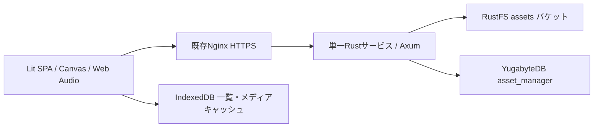

# Kubernetes版アーキテクチャ

現行仕様。Google Drive版設計に優先する。

## 現在の素材登録手順

- 通常登録: 素材ライブラリの「素材を追加」またはファイルのドラッグ＆ドロップから、確認画面を挟まずバックグラウンド登録へ進む。同時実行上限は2件で、画面操作を続けられる。
- ローカル画像の分割: 素材ライブラリの専用「タイル分割」ボタンから画像を読み込み、分割結果のPNGだけを保存する。元画像の登録は不要。
- 既存素材の分割: 素材詳細から「タイル分割」を開く。元画像は自動削除しない。
- 失敗・中断した操作は設定の操作記録から未完了分だけ再試行する。完了済みファイルは再送しない。

## 利用範囲

個人専用・プライベートLAN内、アプリログインなし。Nginx HTTPS公開パスは `/asset-manager/`。外部公開やルーター設定変更は行わない。OriginとFetch Metadataによる異なるサイトからの書き込み拒否を行い、S3資格情報をブラウザへ渡さない。`ALLOWED_ORIGINS` は許可するOriginをカンマ区切りで指定し、完全一致と `https://*.example.com` 形式のサブドメインパターンを利用できる。未設定時は従来の `PUBLIC_ORIGIN` を使う。

## 最小構成

新設する常駐サービスはRustアプリ1つ、初期レプリカ1。Viteの静的成果物も同じプロセスが配信する。画像分割・合成・効果音生成・波形生成はブラウザで行う。新しいメッセージキュー、Redis、S3ゲートウェイ、アプリ用PVCは追加しない。

Rust依存はAxum/Tokio、object_store S3クライアント、tokio-postgresと小さな接続プール、Serde、SHA-256、UUID、日時、静的配信用tower-http。依存バージョンはCargo.lockで固定する。S3対応SDKを使い署名を独自実装しない。

## 一元的なファイルモデル

`assetId` はUUID。メタデータは `fileId`（assetIdと同一）、name、type、mimeType、size、version、sha256、modifiedTime、description、tagIds。素材種別ディレクトリ、kind、role、parentAssetIdは存在しない。

RustFSのオブジェクトキーは拡張子や素材種別を含めないランダムUUIDで、バケット直下に置く。更新時は新しいUUIDへ書き、DBの参照先を切り替える。素材IDは変化しない。人間向けファイル名とタグはDBで管理するため、名前変更・分類変更にS3コピーを必要としない。

YugabyteDBには新規データベース `asset_manager`、所有者 `asset_manager_owner`（NOLOGIN）、実行用 `asset_manager_app`（非管理者）を設ける。`assets` はID・メタデータJSONB・object_key・version・削除状態、`tags` はID・表示名・色。外部キーによる素材参照制約は設けない。実行用ロールは専用テーブルのDMLのみ許可する。

## タグと編集用JSON

登録時に拡張子（大文字小文字を区別しない）から `image=画像`、`audio=音声`、`json=JSON` をサーバーで付与する。登録・更新時に古い型タグは再計算する。ユーザータグを追加できる。タグは最大50個。

編集用JSONは通常の素材として同じAPI・一覧へ保存する。エディター固有タグは `editor-map=マップ編集`、`editor-character=キャラクター合成`、`editor-sound=効果音編集`。JSON Schema検証は各エディターで行い、読み込み不正時は明示エラーを表示する。一般JSONには固有タグを自動推測しない。

合成の出力はPNG、効果音の出力は44.1kHz/16bit/mono WAV。編集用JSONと出力ファイルに親子関係は持たせない。Projectという内部変数名は編集状態を示し、サーバーの保存種別ではない。旧下書きストアは開く一覧には使わない。

## 欠落画像・タイル分割

参照画像の削除を許容する。参照IDと配置をJSON内に保持し、取得できない画像はプレースホルダーで描画する。JSONの再保存を欠落参照で拒否しない。素材の差し替えや参照解除を行える。削除時の参照表示は情報提供であり、参照があることを理由に削除を禁止しない。

素材ライブラリの専用「タイル分割」ボタンからローカル画像を読み込むと、ローカルBlobを分割して結果PNGだけをアップロードする。既存素材の分割も可能だが元画像を自動削除しない。派生素材フィルター、親子削除、元画像の保存必須条件は廃止する。

## API

|メソッド・パス（/asset-manager/api 以下）|用途|
|---|---|
|GET assets?after=UUID|メタデータ一覧、500件ずつ|
|GET assets/:id|メタデータ|
|GET assets/:id/content|本体をS3からストリーム配信|
|PUT assets/:id/content|multipart metadata→file、作成・本体更新|
|PATCH assets/:id|名前・タグ・説明の更新|
|DELETE assets/:id|参照を許容して削除|
|GET tags / POST tags|タグ一覧・作成|

更新と削除にはIf-Matchでversionを送る。競合時409、バージョン未指定428、未発見404、サイズ超過413、保存先障害503。クライアントは操作ジャーナルの完了ファイルを再送しない。新規作成の再送は同じID・SHA-256・名前が一致すると既存結果を返す。

一覧はDBのページングのみで取得し、S3 LISTやオブジェクト単位のメタデータGETを行わない。ブラウザには全ページの成功後にまとめて反映する。ページング中の並行追加は次の一覧更新で反映される場合がある。サムネイルはブラウザで生成・キャッシュし、S3に重複保存しない。

## 容量・障害整合性

1回のUI登録は合計1GB、1HTTPファイルは最大1GB。Rustは同時アップロード2件、S3へ8MiBバッファ・最大2並列で送信し、1GBをRAMへ展開しない。Nginxのリクエストバッファリングを無効にする。

本体転送完了後にDBへ登録する。DB更新はversion比較で競合を拒否し、競合した新オブジェクトは削除する。更新前オブジェクトは切替成功後に削除する。削除はまずDBを削除状態にし、その後本体を削除する。物理削除が失敗した場合は同じID/versionで再試行できる。

S3とDBをまたぐ分散トランザクションはない。プロセス停止や切替後の削除失敗で未参照オブジェクト／未完了multipartが残る可能性がある。自動でバケット全体を掃除しない。運用ではDBのobject_keyと照合し、進行中操作を除外し、十分な猶予を置いてアプリの未参照物だけを明示的に整理する。既存の他アプリの物を消さない。

## 運用と移行

稼働中のストレージやPVの保持設定を変更しない。アプリ用SecretにDB接続文字列とassets限定S3資格情報を保存する。復旧にはRustFSバケット本体とDBの両方の整合したバックアップが必要。UIのマニフェストは本体バックアップではない。

旧Google Driveはそのまま残し、自動移行・削除しない。新ブラウザDB `asset-atelier-rustfs-v2` を使用する。旧版JSONを移すときは参照画像のID対応を保持してインポートする必要があり、単に画像を新規登録しただけでは古い参照IDは一致しない。

ソースとマニフェストの正本は [uiui611/asset-manager](https://github.com/uiui611/asset-manager)。GitHub Actions が UI と Rust を単一イメージにビルドして GHCR へ公開し、OIDC 認証付き webhook で Deployment の更新を通知する。`main` タグと `imagePullPolicy: Always` を利用し、通知失敗は許容する。マニフェスト自体の変更は別途適用する。[デプロイ手順](../deploy/README.md) を参照。

運用ルール: 本リポジトリの `AGENTS.md` と、Ubuntu の構成を編集する場合は `/home/mizu/containers/AGENTS.md` を参照。マニフェストを宣言的に保持し、Secret実値は記録しない。既存環境では DB / Secret / S3 の初期化を再実行しない。

参照: [Axum multipart](https://docs.rs/axum/latest/axum/extract/multipart/struct.Multipart.html)、[object_store buffered writer](https://docs.rs/object_store/0.12.4/object_store/buffered/struct.BufWriter.html)、[YugabyteDB YSQL](https://docs.yugabyte.com/stable/api/ysql/)、[RustFS IAM](https://docs.rustfs.com/en/security-compliance/iam)。

## 編集・保存

編集中のJSONとUndo/Redo履歴は画面内メモリだけに保持する。自動的な下書き保存、下書きのサーバー同期、旧ローカル下書きからの復元は行わない。「開く」は保存済み素材をサーバーから取得する。保存時の楽観ロックには開いた時点のversionを用いる。別名保存は新しいUUIDを作成し、Undoで元UUIDに戻さない。保存中の変更は未保存として残す。

キャラクターJSONのpreviewImageに最大192pxのPNG data URLを格納する。JSON保存時だけ生成するため、参照素材の更新・削除には追従しない。画像パレット・ライブラリ表示にはバージョン付きサムネイルキャッシュを使う。

効果音JSONはformat=multitrack、tracksにid/name/parameters/gain/offset/mutedを格納する（最大8）。旧jsfxr JSONは読み込み時に1トラックへ変換する。内部の音源生成にjsfxrを使用し、各トラックを44.1kHzの同じ時間軸へ加算する。ピークが1を超えた場合は全体を同じ比率で減衰する。波形の再計算は120msのデバウンス。トラック単体の生成結果は最大20秒、開始位置は0〜10秒。

素材のバックグラウンド登録は冒頭の同時実行上限に従い、画面操作をブロックしない。失敗した登録は従来の操作記録から再試行できる。編集中のJSONそのものは操作記録に保存しない。素材本体やサムネイルなどのキャッシュと、編集用Undo/Redo履歴は用途を分ける。

## スプライト再生とエクスポート

スプライトシートは保存用の新しい素材種別を作らず、ブラウザ内で再生確認する。登録画像は既存の本体取得APIから読み込み、端末画像はローカル読込だけに使う。均等格子を左上から横方向に列挙し、幅・高さ・上/左余白・間隔を指定する。開始/終了コマ、1〜60FPS、ループ、停止・コマ送り・拡大表示に対応。範囲外の端数は除外し、最大10,000コマ。画面を離れるかブラウザが非表示になると再生を停止する。

3エディター共通で「開く」「インポート」「エクスポート」に表記を統一。エクスポートはBlobを端末へダウンロードし、APIへの保存を行わない。サーバー保存は「保存する」「別名で保存する」で明示的に行う。

## タイル画像セットと並列処理

MapLayerに任意のtileset（assetId、tileWidth、tileHeight）を追加。新しいマップはレイヤーごとに画像セットを参照し、cellsは左上から行方向に数えたコマ番号を格納する。従来JSONのtilesets配列とセル番号は読み込み・描画互換を維持する。参照先の欠落や画像外のコマはプレースホルダー表示とし、編集・保存を続けられる。

タイル合成は256枚・4096×4096px以下。同じ幅・高さのみ許可し、拡大縮小せず選択順に並べる。元画像を削除する選択は既定で無効。合成画像を保存した後、元画像のversionを指定して削除する。プレビュー後の更新を検知した場合は選択し直しを求める。合成保存失敗では元画像を削除しない。

保存は共通の同時実行上限2、削除・タグ更新は4。進捗は完了件数／総件数。ジャーナルのチェックポイントは直列に保存し、実行中の処理が終わってから失敗・中断を確定する。再試行は未完了分だけを扱う。通常登録の操作と同時実行上限は冒頭「現在の素材登録手順」を参照。

音声の波形更新120msとは別に、音に影響するパラメータ変更を350msでdebounceしてミックス音を再生する。名前変更や新規表示だけでは再生しない。停止・画面破棄・新規作成・読込時に予約を取り消す。

## キャラクターの移動・切り出し保存

選択レイヤーのドラッグはキャンバスの実寸と表示寸法から移動量を換算し、1ドラッグを1回のUndoにする。キャンバス上のホイールで表示倍率を5〜1600%に調整する。

切り出し保存は、各レイヤー単独を現在のキャンバスサイズに描画しPNGへ変換する。非表示レイヤーも画像生成するが、JSONのvisibleは保持する。座標・倍率・回転・透明度を画像に反映し、上書き成功したレイヤーを0,0・1倍・回転0・透明度1に正規化する。画像のIDは変えず、名前は.pngにする。タグ・説明を保持する。重複した素材ID・欠落・無効JSON・事前のバージョン不一致は上書き前に拒否する。

全画像の生成後に最大2件を並列保存し、versionで競合を検知する。応答が失われてもサーバー上の名前・SHA-256が結果と一致すれば成功として扱う。成功したレイヤーだけを正規化し、最後に編集JSONとサムネイルを保存する。途中エラー・中断でも完了分のJSONを保存し、未完了分の変換は維持する。JSON保存に失敗した場合は編集状態を画面に残し、保存／別名保存へ案内する。Undoは元素材の旧内容を復元できないため履歴をクリアする。

実行前の確認ダイアログに他の参照への影響と不可逆性を表示する。処理中は画面遷移・編集を抑止し、ブラウザを閉じる操作は未保存確認の対象にする。複数ファイルとJSONの更新は単一トランザクションではないため、処理中のタブ強制終了・長時間の通信断では部分更新が残り得る。
